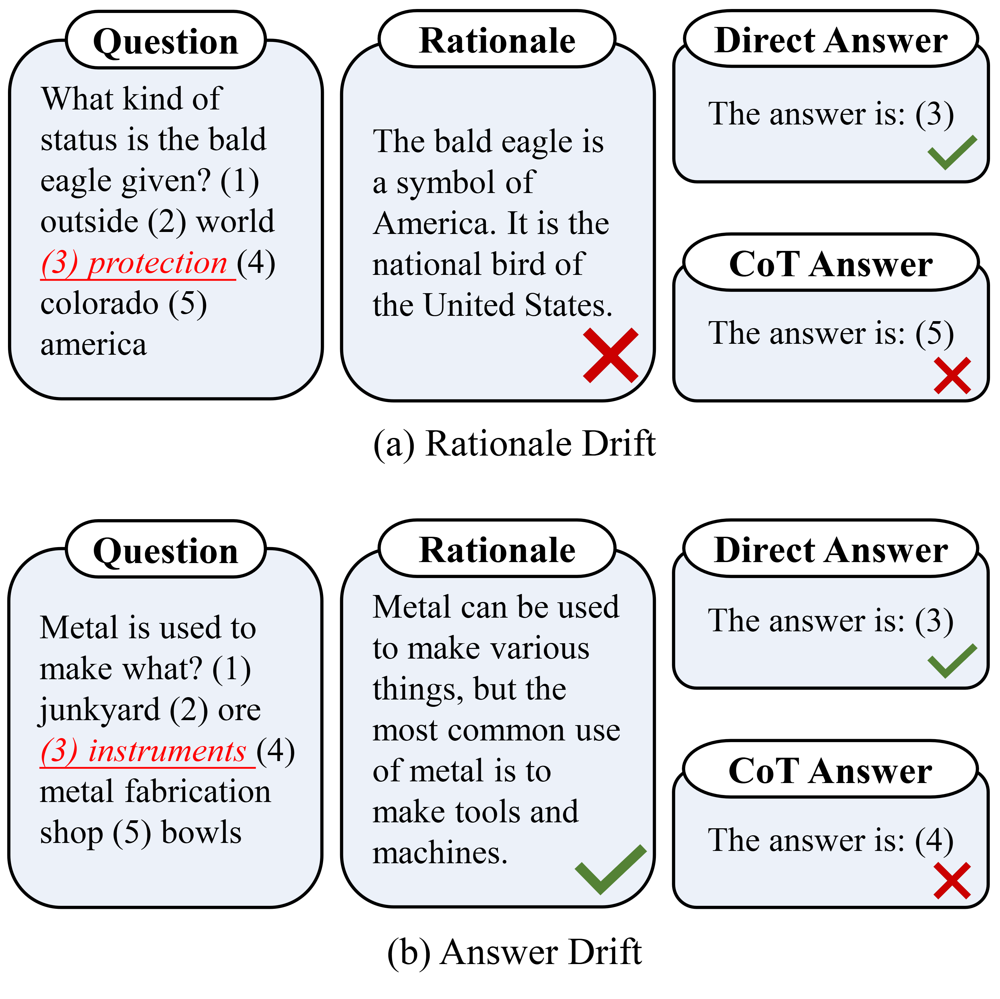

## Focus on Your Question! Interpreting and Mitigating Toxic CoT Problems in Commonsense Reasoning 

[[Paper]](https://arxiv.org/abs/2402.18344)



#### 0. Instructions

This repository hosts the codes of our work: ***"Focus on Your Question! Interpreting and Mitigating Toxic CoT Problems in Commonsense Reasoning"***, which is accepted in **ACL 2024 main** conference.


#### 1. Installation

```python
git clone https://github.com/jinzhuoran/toxic_cot.git
cd toxic_cot
pip install -r requirements.txt
```


#### 2. Run Attribution Tracing Experiment

```python
python llm_cot_probe.py
```


#### 3. Run Intervention Tracing Experiment

```python
python llm_intervention.py
```


#### 4. Run Residual Decoding Method

```python
python res_reason.py
```


#### 5. Run Serial-Position Swap Method

```python
python rt_reason.py
```


#### 6. Run Baselines

```python
python llm_reason.py
```

